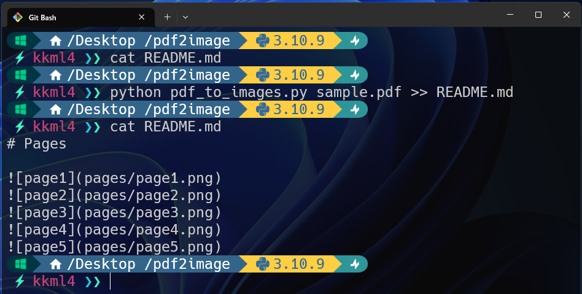

# pdf-to-images


pdf ファイルを画像に出力し md ファイルに追記

## Demo



## Installation

```bash
git clone https://github.com/kkml4220/pdf-to-images.git
cd pdf-to-images
pip install -r requirements.txt
```

## Usage

md ファイルに追記できるように標準出力をリダイレクトすることをおすすめします。

```bash
python pdf_to_images.py >> README.md
```

## Pages


## Author

- 作成者 : 高橋 克征 (Takahashi Katsuyuki)
- E-mail : [Takahashi.Katsuyuki.github@gmail.com](Takahashi.Katsuyuki.github@gmail.com)

## License

"pdf-to-images" is under [MIT license](https://en.wikipedia.org/wiki/MIT_License).
